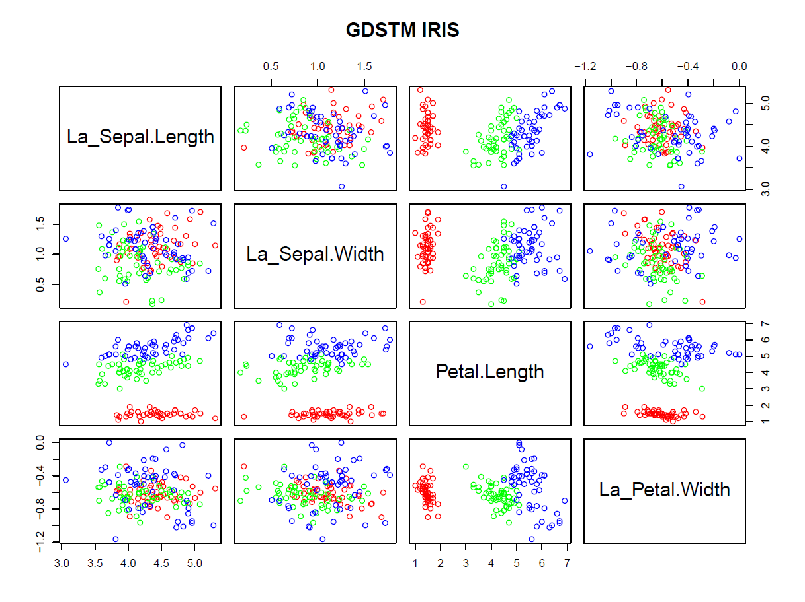

# FDeA and GDSTM

Feature Decorrelation Analysis (FDeA) and the Goal Driven Spatial Transformation Matrices (GDSTM)

This document describes the use of the **FRESA.CAD::GDSTMDecorrelation(), FRESA.CAD::getLatentCoefficients(decorrelatedobject)** and**FRESA.CAD::** **filteredFit()** functions to run feature decorrelation analysis (**FDeA**) algorithm.

-   **FDeA_Options_testing.Rmd** runs a script of the Vehicle data set showcasing the use *GDSTMDecorrelation()* for decorrelation, feature analysis and ML (**NB**).

    -   Output at: <https://rpubs.com/J_Tamez/DecorrelationVehicle>

-   **FDeA_Options_testing_mfeat.Rmd** runs a simpler script on the multiple feature dataset.

    -   Output at: <https://rpubs.com/J_Tamez/MultipleFeatureFDeA>

-   **FDeA_ML_testing_sonar.Rmd** is an example of how to run *filteredFit()*: (**NB** and **LASSO**) with decorrelation on the Sonar dataset

    -   Output at: <https://rpubs.com/J_Tamez/DecorrelationMLSonar>

-   **FDeA_ML_testing_ARCENE.Rmd** is an example of *filteredFit()* (Logistic **LASSO**) and with decorrelation on the Arcene dataset. (Due to the large dimensions of the ARCENE dataset the script will take several minutes to run)

    -   output at: <https://rpubs.com/J_Tamez/ARCENE_GDSTM>

-   **ParkisonAnalysis_TrainTest.Rmd** is a demo shows the use of GDSTM and BSWiMS to gain insight of the features associated with a relevant outcome. Highlight process and functions that will aid authors to discern and statistically describe the relevant features associated with an specific outcome.

    -   output at: <https://rpubs.com/J_Tamez/GDSTMFeatureDiscovery>

-   **irisexample.R** showcase the effect of the FDeA algorithm on the iris data set.

    -   Here an example of the output
    -   

