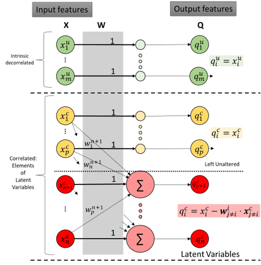
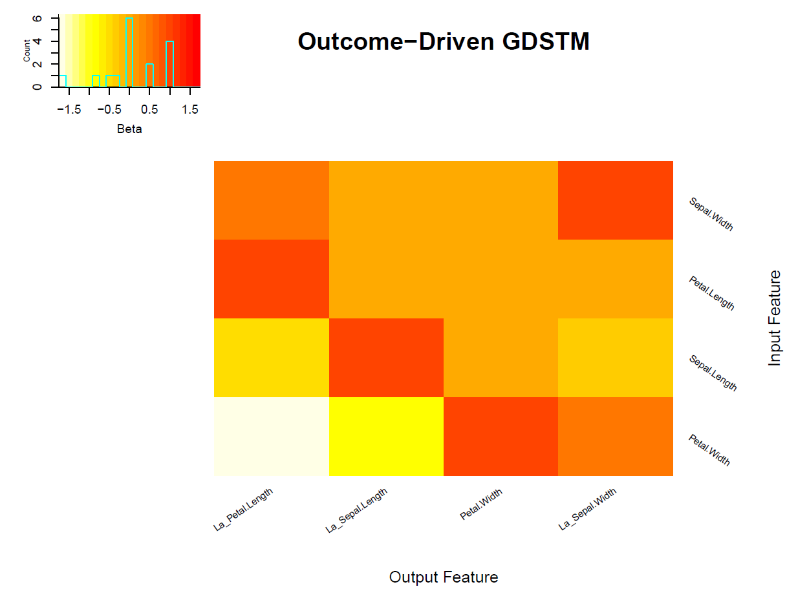
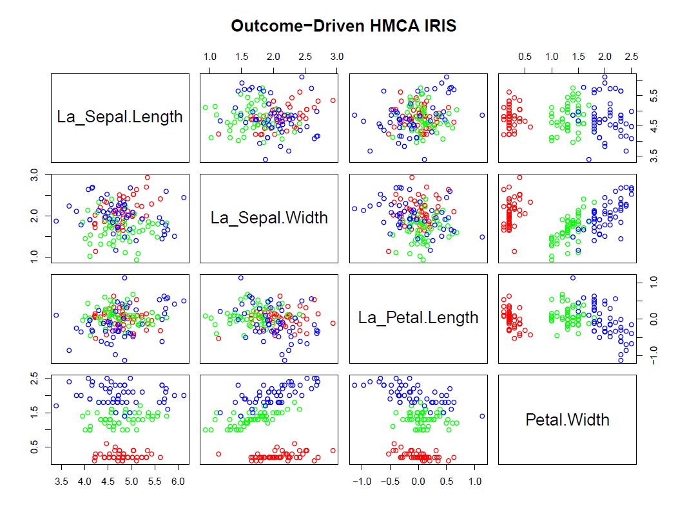

# Heuristic Multidimensional Correlation Analysis: Goal-Driven Spatial Transformation Matrices



Fig. 1. The weights ($w_j^i$) of the GDSTM matrix (**W**) are estimated by the HMCA algorithm.

\_\_\_\_\_\_\_\_\_\_\_\_\_\_\_\_\_\_\_\_\_\_\_\_\_\_\_\_\_\_\_\_\_\_\_\_\_\_\_\_\_\_\_\_\_\_\_\_\_\_\_\_\_\_\_\_\_\_\_\_\_\_\_\_\_\_\_\_\_\_\_\_\_\_\_\_\_\_\_\_\_\_\_\_\_\_\_\_\_\_\_\_\_\_\_\_\_\_\_\_\_\_\_\_\_\_\_\_\_

Many multidimensional/multimodality data sets contain continuous features that are co-linear, correlated or have some association between them. The goal of spatial transformations is to find a set of [latent variables](https://en.wikipedia.org/wiki/Latent_and_observable_variables) with minimum data correlation; hence downstream data analysis be simplified. Common data transformation matrices include statistically driven approaches such as [principal component analysis](https://en.wikipedia.org/wiki/Principal_component_analysis) (PCA), [explanatory factor analysis](https://en.wikipedia.org/wiki/Exploratory_factor_analysis) (EFA), and [canonical-correlation analysis](https://en.wikipedia.org/wiki/Canonical_correlation) (CCA). An heuristic alternative for these two statistical approaches is the heuristic-multidimensional correlation analysis (HMCA). The main advantage of the heuristic approach is that it is driven by specific requirements for the output generated. The specific requirements are:

1.  All output variables $Q=(q_1,...q_n)$ have a parent input variable $X=(x_1,...x_n)$ (See Fig 1.)

    -   The [unit of measure](https://en.wikipedia.org/wiki/Unit_of_measurement) of the returned variable, $x_i$, must be the same as the parent, $y_i$, measurement unit. i.e., output variable and parent variable are [commensurable](https://en.wikipedia.org/wiki/Dimensional_analysis).

    -   The number of generated [latent variables](https://en.wikipedia.org/wiki/Latent_and_observable_variables) should be as small as possible.

        -   Each one of the returned latent variables should be easily [explainable and interpretable](https://en.wikipedia.org/wiki/Explainable_artificial_intelligence).

2.  The user can specify the maximum significant [correlation](https://en.wikipedia.org/wiki/Correlation_coefficient) coefficient among the returned variable set. i.e., None of the correlation pairs should have statistically significant correlation greater than the user specified goal.

    -   i.e., if the correlation of the variables $(q_i,q_j)$ is lower than the maximum correlation or if the correlation is not statistically significant, the algorithm does not try to remove the correlation among these variables.

    -   The correlation measure can be user specified. i.e. [Pearson's](https://en.wikipedia.org/wiki/Pearson_correlation_coefficient) $r$, [Spearman's](https://en.wikipedia.org/wiki/Spearman%27s_rank_correlation_coefficient) $ρ$ or [Kendall's](https://en.wikipedia.org/wiki/Kendall_rank_correlation_coefficient) $τ$.

These requirements are addressed by an heuristic algorithm that creates a goal-driven spatial transformation matrix (GDSTM). Besides a correlation method, and a correlation goal, the algorithm requires a linear modeling function, hence users can specify linear fit, or robust fits. For Machine learning applications the user can specify the target outcome.

## Software

The HMCA algorithm is implemented in the FRESA.CAD R package

### Installing the latest version:

```{r}
library(devtools)
install_github("joseTamezPena/FRESA.CAD")
```

### Installing from CRAN

```{r}
install("FRESA.CAD")
```

## Usage

```{r}
library("FRESA.CAD")
data('iris')

## HMCA Decorrelation at 0.25 threshold, pearson and fast estimation 
irisDecor <- GDSTMDecorrelation(iris,thr=0.25)

### Print the latent variables
print(getLatentCoefficients(irisDecor))
```

#### Output:

```{=asciidoc}
$La_Sepal.Length
Sepal.Length Petal.Length 
   1.0000000   -0.4089223 

$La_Sepal.Width
Sepal.Length  Sepal.Width Petal.Length 
  -0.5611860    1.0000000    0.3352667 

$La_Petal.Width
Sepal.Length  Sepal.Width Petal.Length  Petal.Width 
   0.1250483   -0.2228285   -0.4904624    1.0000000 
   
```
## Advanced Examples

This repository show some examples of the **FRESA.CAD::GDSTMDecorrelation(), FRESA.CAD::getLatentCoefficients(decorrelatedobject)** and**FRESA.CAD::** **filteredFit()** functions.

-   **irisexample.R** showcase the effect of the HMCA algorithm on the iris data set.

    -   Here an example of the output
    -   

-   

-   **ParkisonAnalysis_TrainTest.Rmd** is a demo shows the use of GDSTM and BSWiMS to gain insight of the features associated with a relevant outcome. Highlight process and functions that will aid authors to discern and statistically describe the relevant features associated with an specific outcome.

    -   output at: <https://rpubs.com/J_Tamez/GDSTMFeatureDiscovery>

-   **FDeA_Options_testing.Rmd** runs a script of the Vehicle data set showcasing the use *GDSTMDecorrelation()* for decorrelation, feature analysis and ML (**NB**).

    -   Output at: <https://rpubs.com/J_Tamez/DecorrelationVehicle>

-   **FDeA_Options_testing_mfeat.Rmd** runs a simpler script on the multiple feature dataset.

    -   Output at: <https://rpubs.com/J_Tamez/MultipleFeatureFDeA>

-   **FDeA_ML_testing_sonar.Rmd** is an example of how to run *filteredFit()*: (**NB** and **LASSO**) with decorrelation on the Sonar dataset

    -   Output at: <https://rpubs.com/J_Tamez/DecorrelationMLSonar>

-   **FDeA_ML_testing_ARCENE.Rmd** is an example of *filteredFit()* (Logistic **LASSO**) and with decorrelation on the Arcene dataset. (Due to the large dimensions of the ARCENE dataset the script will take several minutes to run)

    -   output at: <https://rpubs.com/J_Tamez/ARCENE_GDSTM>
