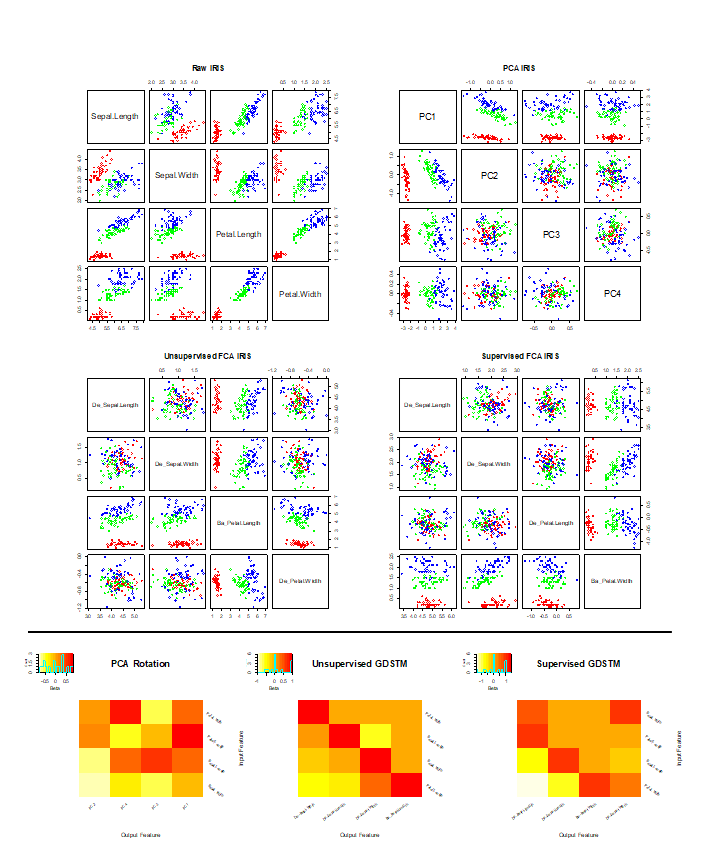

# FDeA and GDSTM

Feature Decorrelation Analysis (FDeA) and the Goal Driven Spatial Transformation Matrices (GDSTM)

This document describes the use of the **FRESA.CAD::GDSTMDecorrelation()** and **filteredFit()** functions to run feature decorrelation analysis (**FDeA**) algorithm for ML purposes.

-   **FDeA_Options_testing.Rmd** runs a script of the Vehicle data set showcasing the use *GDSTMDecorrelation()* for decorrelation, feature analysis and ML (**NB**).

    -   Output at: <https://rpubs.com/J_Tamez/GDSTMDecorrelation_tutorial>

-   **FDeA_Options_testing_mfeat.Rmd** runs a simpler script on the multiple feature dataset.

    -   Output at: <https://rpubs.com/J_Tamez/GDSTMDecorrelation_mfeat>

-   **FDeA_ML_testing_sonar.Rmd** is an example of how to run *filteredFit()*: (**NB** and **LASSO**) with decorrelation on the Sonar dataset

    -   Output at: <https://rpubs.com/J_Tamez/FilteredFit_Decorrelation>

-   **FDeA_ML_testing_ARCENE.Rmd** is an example of *filteredFit()* (Logistic **LASSO**) and with decorrelation on the Arcene dataset. (Due to the large dimensions of the ARCENE dataset the script will take several minutes to run)

    -   output at: <https://rpubs.com/J_Tamez/Arcene_FilteredFit>

-   **irisexample.R** showcase the effect of the FCA algorithm on the iris dataset.

    -   Here an example of the output

